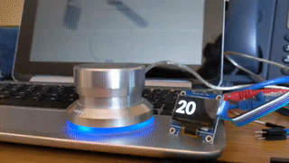

# Cattmate

A WiFi enabled physical volume knob for Chromecasts via a mash up of Griffin's no longer made USB device the 
[PowerMate](https://support.griffintechnology.com/product/powermate/) and
the awesome python Chromecast controlling library [catt](https://github.com/skorokithakis/catt/)
using the equally awesome [powermate](https://github.com/bethebunny/powermate)
 python library.

Here's the current demo in an animated gif.  Behind the PowerMate is a Chromebook running the
Google Home app.  When the Cattmate sets the volume you 
can kinda make out Google Home reflect the volume change as well:

## Status   

This project is very much a work in progress. Don't 
use unless you're looking to learn and experiment like am right now ;)

Currently it seems pretty stable. You have to manually start it though, and I haven't
tested daemonizing it.

## Hardware

* Raspbery Pi - I used a [Raspberry Pi Model 3B Rev 1.2](https://amzn.to/2REZXwb)
* PowerMate - Hopefully you can find one used on eBay if you don't already have one
* 0.96" SSD1336 OLED Screen (_optional_) - I use [these from MakerFocus](https://amzn.to/2PKMQqL)
* Chromecast - any sort will do, original, audio or ultra

## Install

These steps assume you have your Pi set up with Raspbian, that it's booted up, connected
to the same WiFi as your Chromecast and that the PowerMate is plugged into one of the Pi's 
USB ports. If your Chromecast is on a different network, but you can get to it by IP, the
config supports IPs instead of Chromecast names. 

1. Make sure the following requirements are installed:
   * [pip3](https://pip.pypa.io/en/stable/installing/)
   * [virtualenv](https://virtualenv.pypa.io/en/stable/) (_optional_)
1. Clone this repo `git clone https://github.com/Ths2-9Y-LqJt6/cattmate.git`
1. Change directories to cattmate `cd cattmate`
1. Create your own virtualenv and activate it `python3 -m venv venv;. venv/bin/activate` (_optional_)
1. Install all the python prerequisites with `pip3 install -r requirements.txt`
1. Create your own config file `cp config.dist.py config.dist` and edit `config.dist` with 
the names or IPs
of the chromecasts you want to use (ony first one supported right now ;) and whether you want
to use an external I2C screen or not
1. Start the cattmate controller `python3 cattmate.py`

## Releases

* 16 Dec 2019 v0.13 - Complete refactor to use native python driver
per [#8](https://github.com/Ths2-9Y-LqJt6/cattmate/issues/8)
* 13 Dec 2019 v0.12 - Add MIN/MAX alerts per [#2](https://github.com/Ths2-9Y-LqJt6/cattmate/issues/2), fix 
[#1](https://github.com/Ths2-9Y-LqJt6/cattmate/issues/1)
* 10 Dec 2019 v0.11 - refactor `ssd1306` lib  to `Csd1306` class, simplify calls to same, refactor for cleaner code 
* 10 Dec 2019 v0.10 - first decently functional code, known issue 
in [#1](https://github.com/Ths2-9Y-LqJt6/cattmate/issues/1) though.